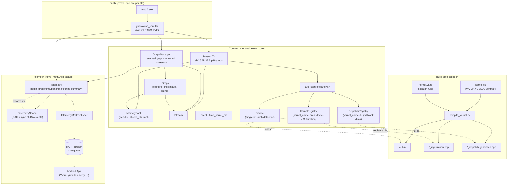

# YadraKoVa

CUDA-native C++ engine for on-device AI training and inference, built from scratch for NVIDIA GPUs (primary target: RTX 3060, `sm_86`). Part of the **Yadra ecosystem**, alongside [YadraCore](#) (Vulkan/Android inference) and YadraTrain (on-device Android LoRA fine-tuning).

BF16 is the default dtype throughout the engine, with explicit support for FP32, FP16, and INT8.

## Highlights

- **WMMA Tensor Core matmul kernel** in BF16 reaching ~9,305 GFLOPS on RTX 3060 (~54.5% of cuBLAS), benchmarked with Nsight Compute's internal Duration measurement to avoid replay-pass timing inflation.
- **CUDA Graph capture** for full pipelines (matmul → GELU → softmax), with strict memory-growth checks during capture.
- **YAML-driven kernel codegen**: kernel dispatch rules (grid/block dims) and registration are generated at build time from `.yaml` + `.cu` pairs, with explicit-instantiation dtype overrides per kernel.
- **Async telemetry pipeline**: zero-sync-in-hot-path CUDA event timing, resolved in a single batched sync point, exported as JSON Lines and published over MQTT for real-time consumption by the Android side of the ecosystem.

## Architecture



## Core components

| Component | Responsibility |
|---|---|
| `Tensor<T>` | Templated N-D tensor (bf16/fp32/fp16/int8), view ops (transpose/permute/slice/reshape) with zero copy, host↔device transfers, factory methods (`randn`, `from_vector`, `from_nested`) |
| `MemoryPool` | Size-class free-list allocator; `Impl` kept alive via `shared_ptr` shared with every outstanding `DeviceBuffer`, so pool destruction order never races against live tensors |
| `Stream` / `Event` | RAII wrappers over `cudaStream_t` / `cudaEvent_t`; `time_kernel_ms` for one-off synchronous timing |
| `Executor` | Resolves a kernel name + dtype + current `Device::arch()` into a `CUfunction` (via `KernelRegistry`) and grid/block dims (via `DispatchRegistry`), then launches it |
| `Device` | Singleton; detects compute capability once and maps it to a `kernels::Arch` |
| `DispatchRegistry` | Maps `(kernel_name, DimMap)` → grid/block/shared-mem launch config |
| `KernelRegistry` | Maps `(kernel_name, arch, dtype)` → compiled `CUfunction`, loaded from generated `.cubin`s |
| `Graph` / `GraphManager` | Wraps `cudaStreamBeginCapture`/`cudaGraphInstantiate`/`cudaGraphLaunch`; `GraphManager` owns N named graphs, N named streams (created lazily), and one shared `Telemetry` instance |
| `Telemetry` | Async, zero-sync-in-hot-path event timing: `begin_async`/`end_async` queue CUDA events, `resolve_pending()` is the single batched sync point. Groups (`begin_group`/`end_group`) tag records so `print_summary()` reconstructs per-iteration timings without magic constants |
| `TelemetryMqttPublisher` | Fire-and-forget (QoS 0) publisher of exported JSON Lines telemetry, decoupled from `Telemetry` itself so the transport can change without touching measurement code |

## Kernel codegen pipeline

Each kernel lives as a `.cu` file under `src/kernels/`. If a matching `.yaml` exists next to it, CMake additionally generates a `*_dispatch.generated.cpp` (dispatch rules) alongside the always-generated `*_registration.cpp` (kernel registration). This is an incremental, kernel-by-kernel migration — kernels without a `.yaml` yet are reported at configure time and still work via the older registration-only path.

Output files are declared explicitly in `CMakeLists.txt` (not globbed), so Ninja treats them as real dependencies regardless of the codegen script's own caching — this closes a race condition that used to cause stale "kernel not registered" errors on incremental builds.

## Building

Requirements: CUDA Toolkit (tested with 13.2), CMake ≥ 4.3, a C++23 + CUDA 20 compiler (tested with MSVC from VS 2026), `PahoMqttCpp` (via vcpkg), Python 3.

```bash
cmake -B cmake-build-debug -S .
cmake --build cmake-build-debug -j 14
ctest --test-dir cmake-build-debug
```

`CMAKE_CUDA_ARCHITECTURES` is currently pinned to `86` (RTX 3060). Adding a new architecture requires updating `Device::map_arch`, the `kernels::Arch` enum, and `config.yaml`.

## Project structure

```
include/          public headers (core/, telemetry/, kernels/)
src/core/         Tensor, MemoryPool, Stream, Event, Graph, GraphManager, Device, Executor
src/telemetry/    Telemetry, TelemetryScope, TelemetryMqttPublisher
src/kernels/      .cu kernels + matching .yaml dispatch rules
scripts/          compile_kernel.py (codegen)
tests/            one executable per test file, auto-discovered by CTest
```

## Status

Active development. Foundational architecture (tensor, memory pool, graph capture, kernel codegen, telemetry) is in place and passing tests. This is a solo, from-scratch project — no external ML framework dependencies in the runtime path.