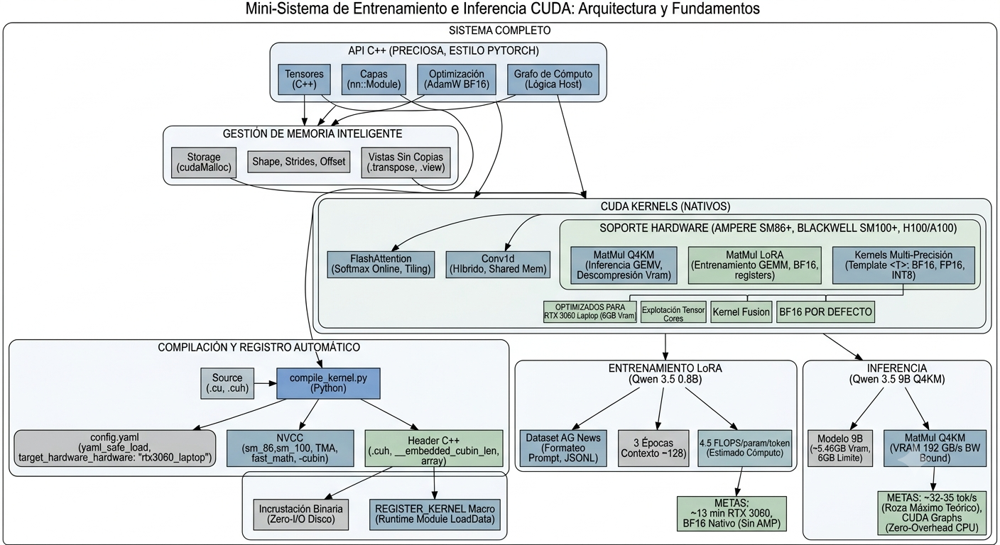

# Evaluación del nuevo sistema

## Puntos fuertes concretos de hoy

- **Cierre del ciclo de auto-registro**  
  Pasaste correctamente de "no hay kernel registrado" a un sistema con `WHOLEARCHIVE` + `OUTPUT` explícito, probado como determinista en build limpio y sucesivo (tres veces).

- **Corrección de precisión en test propio**  
  Detectaste por ti mismo que un test escalar con π (`test_precision_bf16_vs_fp16_diverge`) podía coincidir por casualidad y lo corregiste usando una muestra estadística de 500 valores no alineados. Ese rigor evita falsos positivos silenciosos.

- **Centralización de `CUDA_CHECK` / `CUDA_CHECK_CTX`**  
  Resolviste el pendiente #4 y migraste consistentemente los chequeos a `Stream`, `Event` y `Graph` (con la única excepción de `update_from`, señalada como cosmética).

- **Generalización con `abort_capture()`**  
  Convertiste un problema que viviste a mano en una utilidad reusable. El bug que encontramos en `GraphManager::capture()` demuestra su importancia: sin una propagación correcta de `abort_capture()`, un `Graph` puede quedar atorado permanentemente tras una excepción.

- **Filosofía de diseño consistente en guards**  
  `check_contiguous_for_transfer` en `Tensor` comparte el mismo ADN que `Graph::end_capture()`. En todo el core corre el principio de nunca fallar en silencio, siempre explicar qué se rompió y por qué.

## Áreas que vale la pena vigilar según crezcas

- **Doble implementación de conversión de dtype**  
  `common.cuh::to_float<T>` vs `dtype_utils.h::bf16_to_f32` no es un bug, pero es deuda técnica consciente. Convendrá unificarlas en algún punto.

- **Costo de recompilación completa al tocar `common.cuh`**  
  Hoy con 3 kernels es irrelevante, pero cuando tengas ~30-40 kernels sentirás que cada cambio a un header compartido tarda demasiado. Conviene revisar la estrategia de inclusión antes de llegar a ese punto.

- **`update_from()` en `Graph` sin migrar a `CUDA_CHECK_CTX`**  
  Es un pendiente trivial y cosmético, fácil de resolver en cualquier momento.